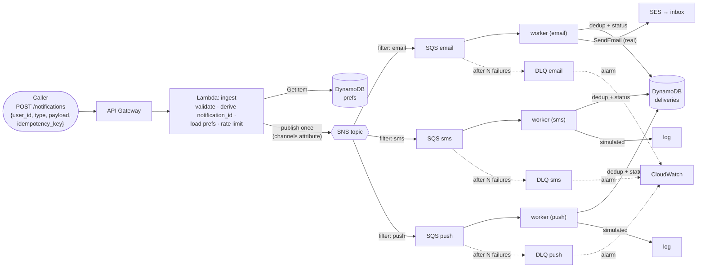
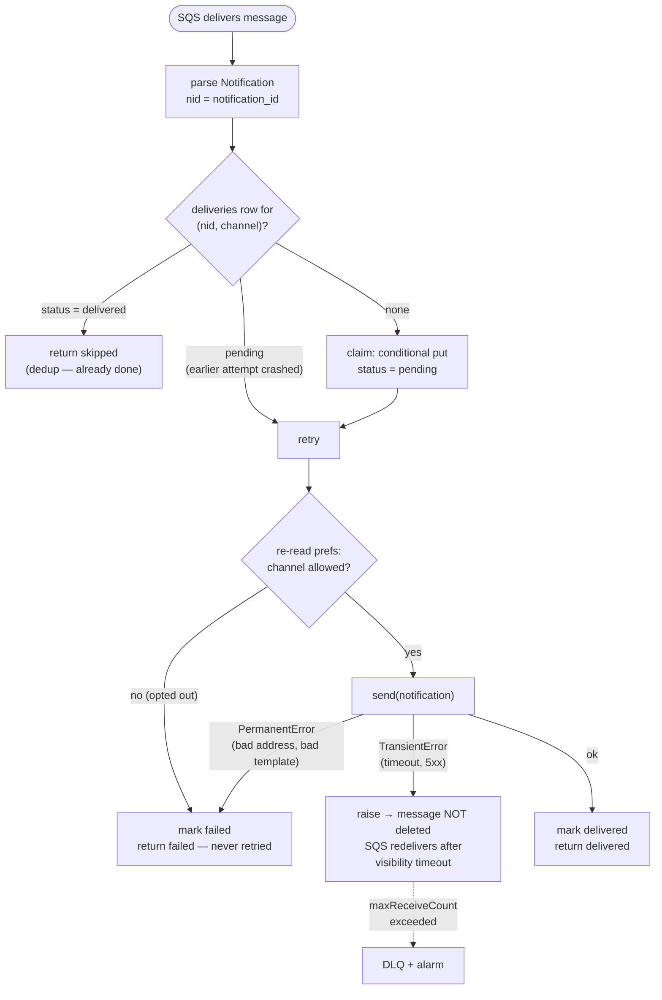

# Notification System on AWS

A learning build of *System Design Interview* ch. 10 on serverless AWS: **API Gateway → Lambda
→ SNS → per-channel SQS → Lambda workers → SES / simulated delivery**, with DynamoDB for
preferences and delivery dedup, all in Terraform, deployed by GitHub Actions via OIDC.

Follow-on to the URL shortener (ch. 8): the same skeleton, now learning the async half of AWS —
queues, fan-out, at-least-once delivery, dead-letter queues, and real email.

## The one idea

A notification's identity is a **caller-supplied idempotency key**, and delivery is deduped
**per (notification, channel)** — so retries anywhere (a timed-out POST, an SQS redelivery, a
crashed worker) collapse to exactly one send per channel. Everything else — per-channel queues
as bulkheads, transient-vs-permanent failure classification, DLQs — protects that guarantee.
The *why* for each choice is in [`docs/adr/`](docs/adr/).

## Architecture

One publish fans out to a queue per channel; each queue is an isolated bulkhead with its
own retries and dead-letter queue (ADR-0002, ADR-0003).



## Activity — one message through a worker

The reliability logic (ADR-0001 dedup, ADR-0005 opt-out re-check, ADR-0003 failure
classification). Raising a transient error is deliberate: it leaves the SQS message
undeleted, which is exactly what makes it retry.



## Layout

```
src/notifier/     models  db  templates  channels/  handlers/   # stdlib + boto3 only
infra/            Terraform (bootstrap/ = state + CI role, kept apart from the app)
tests/            pytest + moto (DynamoDB, SNS, SQS, SES) — no real AWS
docs/             adr/ 0001-0007  glossary.md
```

## Setup (local)

```bash
python -m venv .venv
.venv\Scripts\activate
pip install -e ".[dev]"
pytest
```

## Status

Design hardened via a grilling session (ADR-0001…0007). Done: **M0** (scaffold, bootstrap,
CI, SES identity; ingest stub live), **M1** (domain core + delivery loop, moto-tested),
**M2** (ingest live → SNS), **M3** (per-channel SQS queues + DLQs, worker Lambdas with
partial-batch failure reporting, simulated senders with fault injection, DLQ alarms),
**M4** (per-channel destination addresses; real email via SES with failure classification).

M3 and M4 were each drilled against real AWS, not just moto. The M3 drill found two bugs a
green test suite had missed — both in assumptions about AWS *timing* rather than in logic
(see [ADR-0008](docs/adr/0008-in-flight-is-not-skippable.md)). The M4 drill found that a real
send lands in spam, because mail cannot be authenticated for a domain you do not control
(see [ADR-0004](docs/adr/0004-real-vs-simulated-delivery.md)).

Next: **M6** (per-user rate limiting). **M5** is undefined; the strongest candidate is the
delivery-event feedback loop — today the ledger records `delivered` when SES merely accepted
custody, and true outcomes only arrive asynchronously as bounce/complaint/delivery events.
